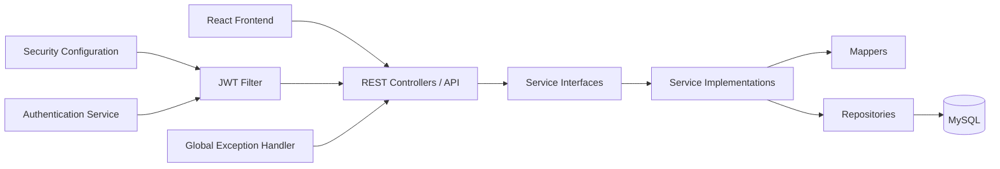
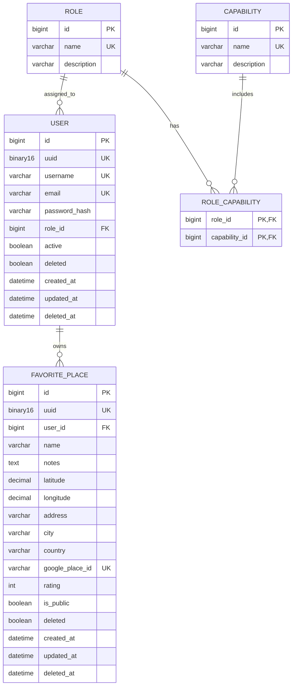

# FoodSpots

Full-stack starter for user authentication and favorite food places management.

## Tech Stack

- **Backend**: Java 21, Spring Boot 3.5, Spring Security, JPA, Flyway, MySQL
- **Frontend**: React + Vite + Tailwind CSS + Axios + React Router
- **Docs**: OpenAPI/Swagger (`springdoc`)
- **Logging**: SLF4J + Logback

## Architecture



## E-R Diagram



## Project Structure

```text
frontend/
├── src/
│   ├── api/
│   ├── pages/
│   └── services/
└── package.json

backend (current root)/
src/main/java/gr/projectfoodspots
├── api
├── authentication
├── config
├── controller
├── dto
├── service
│   └── impl
├── repository
├── model
├── mapper
├── place
│   └── filters
├── security
├── common
│   ├── exception
│   └── filters
└── logging
```

All request/response DTOs live in the single `dto` package (for example `RegisterRequestDTO`, `AuthenticationRequestDTO`, `PlaceReadDTO`, `ErrorResponseDTO`).

## Prerequisites

- Java 21
- MySQL 8+

## Database Setup

Create a database in MySQL:

```sql
CREATE DATABASE foodspots_db CHARACTER SET utf8mb4 COLLATE utf8mb4_0900_ai_ci;
```

Add these properties to `src/main/resources/application.properties` (or create `application-dev.properties`):

```properties
spring.datasource.url=jdbc:mysql://localhost:3306/foodspots_db?useSSL=false&allowPublicKeyRetrieval=true&serverTimezone=UTC
spring.datasource.username=root
spring.datasource.password=your_password

spring.jpa.hibernate.ddl-auto=validate
spring.jpa.open-in-view=false
spring.jpa.properties.hibernate.format_sql=true

spring.flyway.enabled=true
spring.flyway.locations=classpath:db/migration
```

Flyway will auto-run migrations on startup.

## Run the App

### Backend

```bash
./gradlew bootRun
```

On Windows PowerShell:

```powershell
.\gradlew.bat bootRun
```

### Frontend

```bash
cd frontend
npm install
npm run dev
```

Frontend runs at `http://localhost:5173`.

## Swagger / OpenAPI

After app starts:

- Swagger UI: `http://localhost:8080/swagger-ui.html`
- OpenAPI JSON: `http://localhost:8080/api-docs`

### How to test secured APIs in Swagger

1. Call `POST /api/v1/users` to create a user.
2. Call `POST /api/v1/auth/authenticate` and copy the `token`.
3. Click **Authorize** in Swagger.
4. Paste `Bearer <your-token>`.
5. Call secured endpoints (`/api/v1/users/me`, `/api/v1/places/**`).

## Frontend Setup and Flow

Create a frontend env file:

```bash
cd frontend
cp .env.example .env
```

Default API base URL:

```properties
VITE_API_URL=http://localhost:8080/api/v1
```

The places map uses **MapLibre GL** with free OpenFreeMap tiles — no API key required.

Implemented pages:

- `/register` user registration
- `/login` JWT login
- `/places` create + list own places

Map behavior in `/places`:

- Click map to pick coordinates for a new place
- Selected place pin is highlighted in orange
- Saved place pins are blue
- Pins scale up as you zoom out for better readability
- UI is dark themed with Tailwind-based styling

## API List (Current)

### Authentication

- `POST /api/v1/auth/authenticate` — returns `{ "token": "..." }`

### Users

- `POST /api/v1/users` — register a new user
- `GET /api/v1/users/me` (secured)

### Favorite Places (secured)

- `POST /api/v1/places`
- `GET /api/v1/places`
- `GET /api/v1/places/{uuid}`
- `PUT /api/v1/places/{uuid}`
- `DELETE /api/v1/places/{uuid}` (soft delete)

## Logging

Logback config: `src/main/resources/logback-spring.xml`

- Console logs with request context (request id, username, method/path)
- Rolling `logs/app.log`
- Rolling `logs/error.log` (ERROR only)

MDC context is populated by `logging/RequestContextLoggingFilter`.

## Notes

- JWT secret is configured by `app.security.secret-key` (Base64).
- JWT expiration is configured by `app.security.jwt-expiration` (milliseconds).
- CORS is enabled for `http://localhost:5173` by default (`allowed.origins[0]`).
- Security follows the reference pattern: `authentication/` for JWT/auth services, `security/` for filter chain and handlers.
